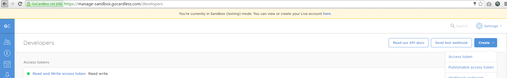

# GoCardless Direct Debit Payment Processor Integration for CiviCRM with Gocardless Pro Api#

### Overview ###

CiviCRM can be integrated with GoCardless Payment Processor

### Installation ###

* Install the extension manually in CiviCRM. More details [here](http://wiki.civicrm.org/confluence/display/CRMDOC/Extensions#Extensions-Installinganewextension) about installing extensions in CiviCRM.
* Create Access Token in Gocardless Developer Dashboard, Make sure token has read and write permission when it is configured 

* Configure new payment processor by selecting 'Gocardless (uk.co.vedaconsulting.payment.gocardlessdd) as Payment Processor Type in CiviCRM

### Usage ###

* Setup CiviCRM Contribution page with gocardless payment processor

* When user registers for that civiCRM Contribution, new subscription will be created in GOcardless 

### Support ###

support (at) vedaconsulting.co.uk

